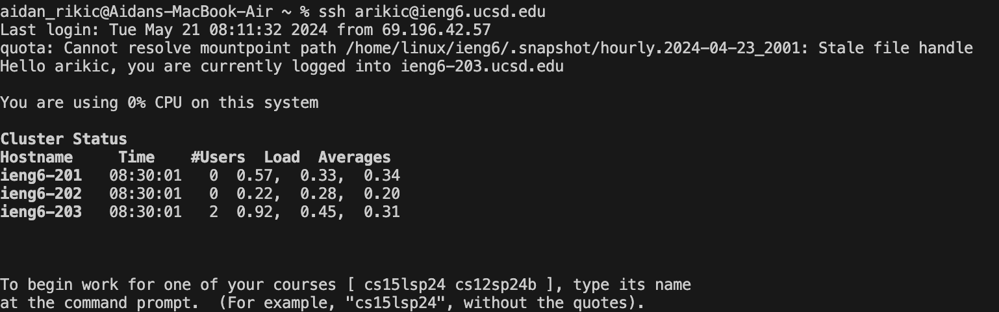

# Lab Report 4 - Vim  
## Aidan Rikic  
Step 4.  

Explanation: To log in to ieng6 I had to type my login of `arikic@ieng6.ucsd.edu`.   

Step 5.  
  
Explanation: To clone the repository I had to copy the link from github, and then type into the terminal `git clone` and then I pasted the copied path with `command v`  

Step 6.  
  
Explanation: To show the test failing I ran the bash script `test.sh`. In order to do that, I typed `bash test.sh`  

Step 7.  
  
Explanation: In order to change the code of the failing tests, I need to go to line 44 in `ListExamples.java` and change index1 to index2. 
I can do this by typing `vim ListExamples.java` then hitting `down` 43 times and `right` 11 times to place the cursor over 1 in `index1`. 
I hit `x` to delete the 1 and then hit `a` and `2` which will append 2 to `index` producing `index2`.  

Step 8.  
  
Explanation: In order to run the tests again, I have to exit vim. So to save what I changed and exit I type `ZZ`. 
Then I typed `bash test.sh` to run the tests again.  

Step 9.  
  
Explanation: In order to commit and push the changes I made to Github I typed in `git add .` that will add all files in the current directory and then
I typed in `git commit -m "It's been committed"` to commit the changes made and then I typed in `git push` to push them to Github. 
